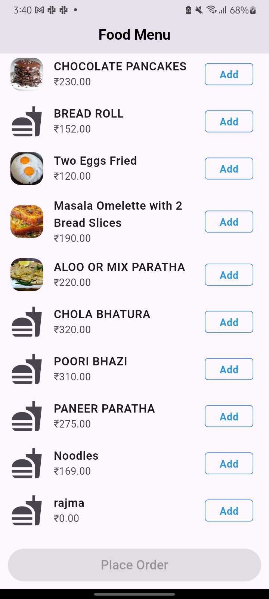
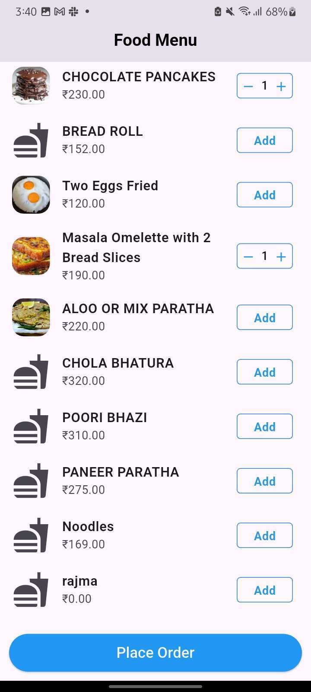
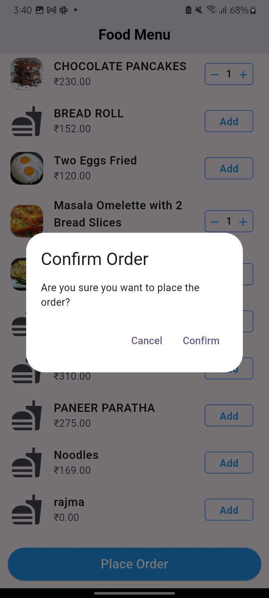
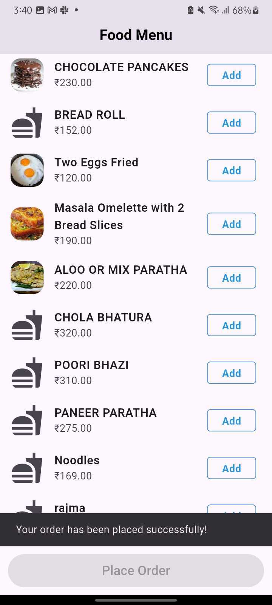

# Mini Food Order Application

This application is show List of Food items, add items in cart and confirmation of order placed.

## Screenshots







## Features

- list of food menu
- Add/remove items from cart
- Place order with confirmation dialog
- State management using GetX

## Getting Started

### Installation

```bash
git clone https://github.com/Ranjan221120/wayinfotech.git
cd wayinfotech
flutter pub get
```

### Running the App

```bash
flutter run
```

## Project Structure

- `lib/model/` - Data models
- `lib/view/` - UI screens
- `lib/viewmodel/` - ViewModels for state management

## Dependencies

- `http`: For API calls
- `GetX`: State management and navigation

## Building for Release

To build an APK:
```bash
flutter build apk --release
```
